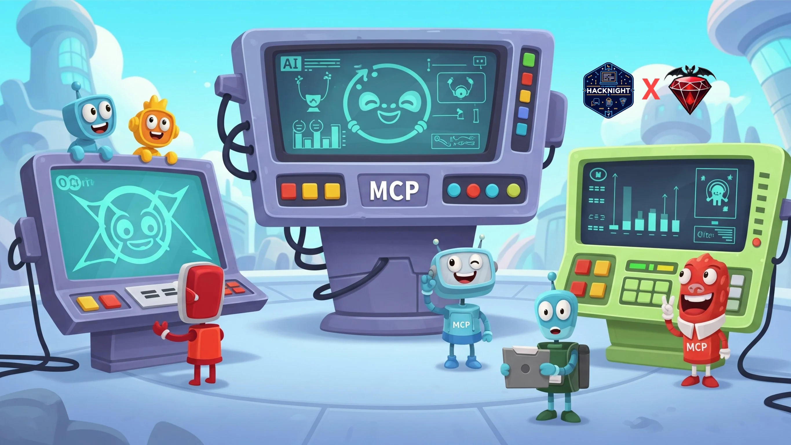

This time [Vestimir Markov](https://vestimir.com) will introduce us to the MCP in a fun **Hands on**
workshop! 

Model-Context-Protocol is a brand new standard for adding tools and expanding 
the capabilities of large language models (LLMs) like GPT or Claude. 
Whether you're working with legacy codebases or building new solutions, 
this session will show you practical ways to use MCP and allow LLMs to 
interact with your existing data and functionality.

Ruby's clear syntax is ideal for understanding new concepts and this session 
goes beyond theory — you'll see a real, functioning MCP integration in a 
production Rails monolith.

**What you'll learn**

- The fundamentals of MCP from a user perspective
- Current revision of the standard, supported clients, and notable server implementations
- Pros and cons compared to other AI integration approaches
- Implementing MCP with local LLMs and other privacy considerations
- Security considerations for MCP integration

**Hands-on workshop**

Following the presentation, we'll break into groups for a practical session 
where you'll build your own MCP tool using our starter repo. You'll be able 
to test your creation with Claude Desktop or Cursor, getting immediate 
feedback and support.
