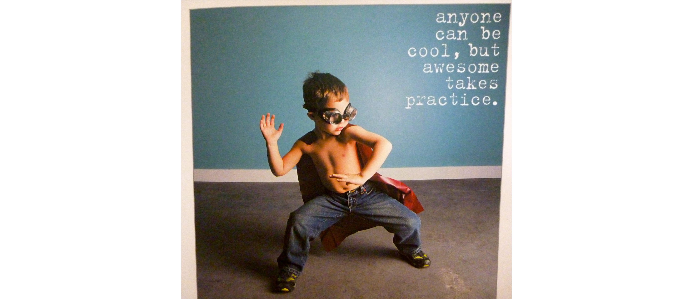

In this edition we invite you all to a ___coding kata challenge___ at the
**GuruWalk** offices.

⚠️ ___Warning, might cause fun and entertainment___ ⚠️

As the summer is looming and the temperatures are rising it's the perfect time
to spend some time having fun with a coding kata challenge. To keep it simple
you will be performing the [FizzBuzz](https://codingdojo.org/kata/FizzBuzz/)
kata as it's simple and can be performed quite quickly when practiced
beforehand (_make sure you study it properly before the event_).

Each person giving it a go will be scored. We will score (_as a group_) on
follwing criteria:

- 🏃🏽‍♂️‍➡️ speed of execution
- 👨🏽‍🔬 test driven approach
- 🧹 code cleansiness
- 😂 fun

Warm up your fingers 💅🏽  and get ready to have some fun coding between friends
and Ruby enthusiasts!
