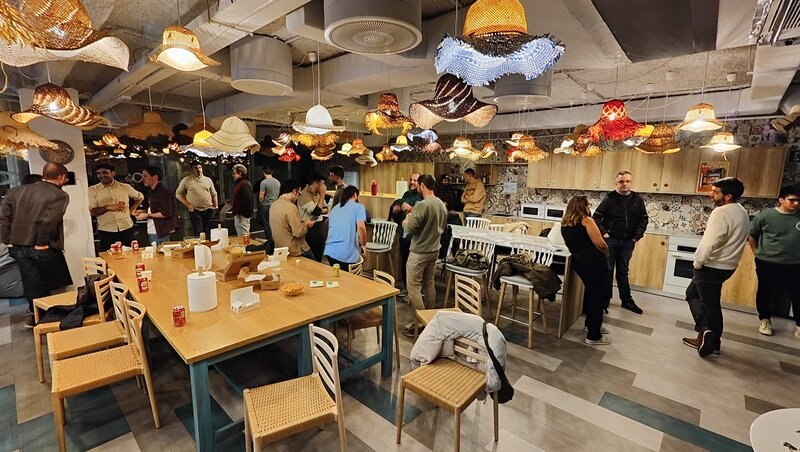

¡El meetup de Ruby Valencia.rb 💎 regresa después de las Fallas! 🎆🧨🔥

**Construyendo manejadores de webhooks confiables con Rails**

Rails no incluye un "framework de webhooks🪝", sin embargo, la mayoría de las aplicaciones Rails en producción dependen de webhooks para pagos, autenticación e integraciones. Esta charla explora las primitivas de Rails y Ruby que ya existen para manejar webhooks, y cómo usarlas para construir consumidores de webhooks confiables.

Cubriremos modos de fallo comunes. Por ejemplo: entrega duplicada, reintentos, verificación de firma, respuestas lentas y mala observabilidad. Y los mapearemos a soluciones concretas usando Active Job, restricciones de Active Record, secure_compare e instrumentación de Rails. A través de ejemplos reales de Ruby y Rails, contrastaremos implementaciones frágiles con patrones de grado producción que pueden resistir reintentos, condiciones de carrera y rarezas de proveedores.

¡Nos vemos el miércoles 25 de marzo en New Work!

**Ponente** 📢 Miguel Torres

Soy Miguel Torres. He estado escribiendo código Ruby durante unos 8 años y he estado en el equipo de Pagos para diferentes empleadores durante 6 de esos 8 años. Eso significa que tengo mucha experiencia tratando con webhooks de Stripe, Ayden, Braintree (principalmente) pero también otros proveedores y he sufrido muchas de las peculiaridades que vienen con ellos.

**Patrocinadores** 🙌

Gracias a [New Work Spain](https://new-work.se/en) por alojar el evento y a [Auth0](https://auth0.com/) por patrocinar los aperitivos que disfrutaremos después de la charla, durante el networking.

  <a href="https://www.meetup.com/vlctechhub/events/313782766/" target="_blank" class="button has-background-red">Regístrate hoy</a>

